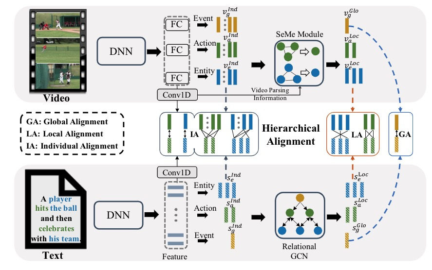

# HANet: Hierarchical Alignment Networks for Video-Text Retrieval (ACMMM 2021)

This repository is the PyTorch implementation of our paper.



## Prerequisites
Python 3 and PyTorch 1.6.

```
# clone the repository
git clone git@github.com:cshizhe/hgr_v2t.git
cd HANet
export PYTHONPATH=$(pwd):${PYTHONPATH}
```

## Datasets
Provided annotations and pretrained features on MSRVTT and VATEX video captioning datasets can be downloaded from [OneDrive](https://stuxidianeducn-my.sharepoint.com/:f:/g/personal/pengwu_stu_xidian_edu_cn/Ejg636v4FltBpnZPWnKbVBsBhQgZ0Kq1ve6zxQPGePwpOQ?e=8YdWO8) (code: hanet). 


### Annotations

- groundtruth: annotation directory

0) noun_gt.json; verb_gt.json; noun_gt_all.json; verb_gt_all.json
1) ref_captions.json: dict, {videoname: [sent]}
2) sent2rolegraph.augment.json: {sent: (graph_nodes, graph_edges)}

- vocabularies: annotation/RET directory
int2word.npy: [word]
word2int.json: {word: int}

- data splits: public_split directory
trn_names.npy, val_names.npy, tst_names.npy

### Features

Resnet152 and I3D features are used for MSR-VTT and VATEX respectively.
These features are extracted by the authors of [hgr](https://github.com/cshizhe/hgr_v2t) and [vatex](https://eric-xw.github.io/vatex-website/download.html), thanks for their wonderful work!

- mean pooling features: ordered_feature/MP directory

format: np array, shape=(num_fts, dim_ft) corresponding to the order in data_split names

- frame-level features: ordered_feature/SA directory

format: hdf5 file, {name: ft}, ft.shape=(num_frames, dim_ft)


## Training & Inference

### Concept Vocabulary
We provided concept vocabulary. If you want to generate concept vocabularies for new datasets, please follow the following instructions.

1. generate concepts and compute frequencies:
```
cd data
python concept_frequency.py ref_caption_file trn_name_file
```

2. generate concept labels:
```
python make_gt.py trn_name_file
```

### Semantic Graph Construction
We provided constructed role graph annotations. If you want to generate role graphs for new datasets, please follow the following instructions.

1. semantic role labeling:
```
python misc/semantic_role_labeling.py ref_caption_file out_file --cuda_device 0
```

2. convert sentence into role graph:
```
cd misc
jupyter notebook
# open parse_sent_to_role_graph.ipynd
```

### Training and Evaluation

*MSR-VTT*
```
# setup config files
# you should modify data paths ==> data/msrvtt/model.json and data/msrvtt/path_msr.json


cd t2vretrieval/driver

# training
python multilevel_match.py ../../data/msrvtt/model.json ../../data/msrvtt/path.json --load_video_first --is_train --resume_file ../../data/msrvtt/word_embeds.glove32b.th

# inference
python multilevel_match.py ../../data/msrvtt/model.json ../../data/msrvtt/path.json --load_video_first --eval_set tst
```

*VATEX*
```
# setup config files
# you should modify data paths ==> data/vatex/model.json and data/vatex/path.json


cd t2vretrieval/driver

# training
python multilevel_match.py ../../data/vatex/model.json ../../data/vatex/path.json --load_video_first --is_train --resume_file ../../data/vatex/word_embeds.glove42b.th

# inference
python multilevel_match.py ../../data/vatex/model.json ../../data/vatex/path.json --load_video_first --eval_set tst
```


## Citations
If you use this code as part of any published research, we'd really appreciate it if you could cite the following paper:
```text
@article{
  title={HANet: Hierarchical Alignment Networks for Video-Text Retrieval},
  author={Wu, Peng and He, Xiangteng and Tang, Mingqian and Lv, Yiliang and Liu, Jing},
  journal={ACM International Conference on Multimedia},
  year={2021}
}
```

## Acknownledgements
Our code is based on the implementation of [hgr cvpr2020](https://github.com/cshizhe/hgr_v2t).  


